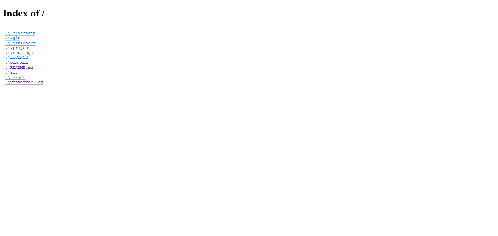
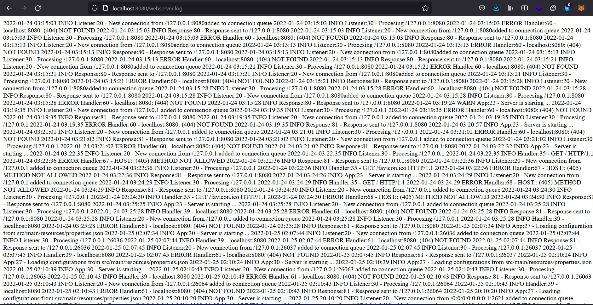

## Java Web Server

A simple multithreaded HTTP server built with the Producer-Consumer design pattern and synchronised with blocking queues.

### Features
- Directory Listing
- Basic HTTP Authentication
- Logs all requests ```webserver.log```

### Configuration

#### Port
The default port used is 8080. It can be modified either by changing the port value in [properties.json](src/main/resources/properties.json) or supply it as an argument in the console.
```console
javac App.java
java App <port_number>
```
#### Basic HTTP Authentication
To enable, change the username value from ```null``` to ```<your_username>``` and password value from ```null``` to a Bcrypt hash of the password in [properties.json](src/main/resources/properties.json)
```json
{
	"username" : "your_username",
	"password" : "Bcrypt hash",
}
```
To disable, set the username and password values as ```null```.

#### Worker Threads and Connection Queue
The number of consumer threads and blocking queue size can be modified in [properties.json](src/main/resources/properties.json)
```json
{
	"worker_threads" : 20,
	"connection_queue" : 30
}
```

#### Screenshots



### TODO
- Request for basic authentication if username & password are set
- Allow user to specify web root folder
